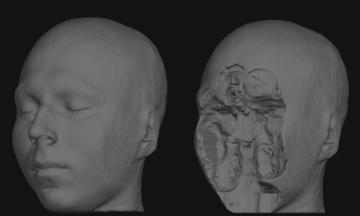
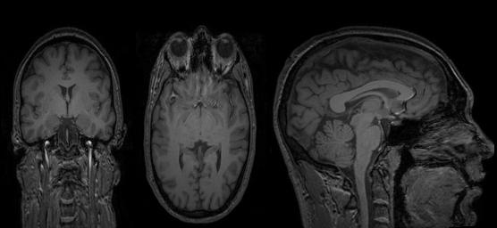

# MRI Deface Detector

The de-identification of Brain MRI (Magnetic Resonance Imaging) scans, which is an important ethical step while publicly sharing datasets, is called defacing. Defacing involves removing or masking the part of the image corresponding to the face, while simultaneously ensuring brain data is not lost in the process.


*Image courtesy of NAMIC*

This javascript tool intends to serve a trained deep learning model to do the job of detecting deface in an MRI scan quickly and efficiently. The tool will be easy to integrate into automatic validators such as the [BIDS Validator](https://github.com/INCF/bids-validator). 

The deep learning model consists of only `34,937` parameters, hence taking a mere `156 KB` overhead on storage, while producing lighting fast predictions on the browser.

This tool can be used in the following ways:

- Installed and used as a node package through npm
- Run on the browser directly
- Build custom model and run your own detector

## Requirements
- Node>=8.9.0
- Python3 (For training custom model)

## Install

Install with npm :
```
$ npm install mri-deface-detector
```

## Basic Usage

```
const detector = require('mri-deface-detector')

// file passed as an ArrayBuffer
mri_scan = detector.readNifti(file)

// result is a prediction indicating probability of deface
detector.detectDeface(mri_scan)
	.then(result => console.log(result))
```

## How to Run the Detector on your Browser

1. Clone the github [repository](https://github.com/wazeerzulfikar/Deface-Detector)
2. `cd` into the cloned repository
3. `$ npm install`
4. `$ npm run watch`
5. Upload a [`NIFTI`](https://brainder.org/2012/09/23/the-nifti-file-format/) file to see results

## Build your own Detector

This requires two steps:

- Train and Export the Deep Learning Model 
- Using Custom Model in the Deface Detector Tool

### Training the Deep Learning Model 

#### Dataset Preparation

The existing model has been trained on the [IXI-Dataset](http://brain-development.org/ixi-dataset/), which would formulate the `Original` dataset. To create the defaced dataset, a defacing tool such as [pydeface](https://github.com/poldracklab/pydeface) was used to create the corresponding defaced dataset. Another popular defacing tool which can be used to add variabality is [mri_deface](https://surfer.nmr.mgh.harvard.edu/fswiki/mri_deface).

The Dataset should be structured in the following way : 

```
Dataset
│
└───Original
│   │	image1.nii.gz 
│   │	image2.nii.gz 
│   │	...
│
└───Defaced
    │	image3.nii.gz 
    │	image4.nii.gz
    │	...
```

The three-dimensional MRI scan is preprocessed to obtain 3 two-dimensional cross-sections using one of mean or slice methods. Examples for each of the two are given below.

##### Mean
Arithmetic mean along each of the dimensions


##### Slice
Center slice along each of the dimensions



Note : The existing model uses `slice` preprocessing. This is provides a faster preprocessing step and simultaneously achieves a good sensitivity and specificity.
On the other hand, the `mean` preprocessing blurs out the intricate details of the neural anatomy, and thus will potentially allow the model to give emphasis to the actual shape of the structure, which is essential for deface detection.

For faster experimentation, the mri data is first stored as numpy(npz) files.

To do this run :

```
python load_dataset.py --load_path path/to/dataset1 path/to/dataset2 .. \
		       --save_path path/to/save/npz/files \
		       --preprocess [Optional] mean/slice
```

As this step takes substantial time due to big sizes of MRI scans, the script allows you keep appending more data as acquired to the numpy storage by just running `load_dataset` using the same `save_path` repeatedly.

#### Train the Model

To train the model :

```
python detector.py --load_path path/to/npz/files \
		   --augment_images False \
		   --export_js False
```

##### Export to JS
Set the `--export_js` flag to True for automatic conversion of the best model to a TensorFlowJS usable form.

##### Augmentations
Set the `--augment_images` to True to augment images, while training, using the transformations below:
- Gaussian Blur
- Contrast Normalization
- Multiply
- Flips
- Rotations

##### Model Architecture
The figure below represents the simplified model architecture:


Note : The weight sharing and elementwise addition features were used specifically to ensure the independence of model performance on the order in which the cross-sections are passed to the model, thus making it more robust.

The model only contains `34,937` parameters making the saved keras model only `495 KB`. The size is further optimized to `156 KB` while converting to the JS form.

##### Metrics

In concordance to the neuroimaging community, the trained model is validated using sensitivity and specificity metrics, where :

`Sensitivity = TP / (TP + FN)`\
`Specificity = TN / (TN + FP)`

Note : The existing model has a `sensitivity = 0.9898` and `specificity = 0.9849` on the Test Set.

### Using the Custom Model in the Deface Detector Tool

The model trained using `detector.py` (with export_js=True) will be stored in `/models` as `model_js`

```
const detector = require('mri-deface-detector')
var model = detector.loadModel('path/to/model_js/model.json')

// file passed as an ArrayBuffer
mri_scan = detector.readNifti(file)

detector.detectDefaceCustom(model, mri_scan, preprocess_method, input_size, callback)
	.then(result => console.log(result))
```

## Next Steps

- ~~Fix the NIFTI file read, which is corrupted right now.~~
- ~~Implement mean preprocessing in javascript detector tool.~~
- ~~Make integratable into other validators.~~
- Add unit tests
